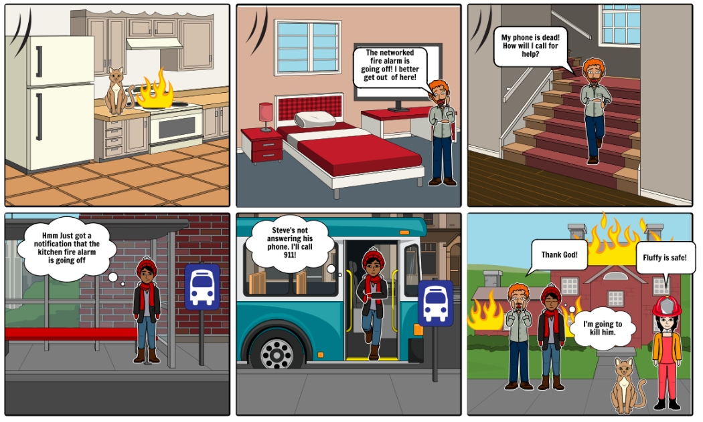
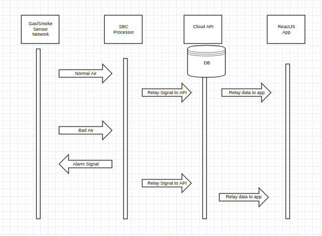
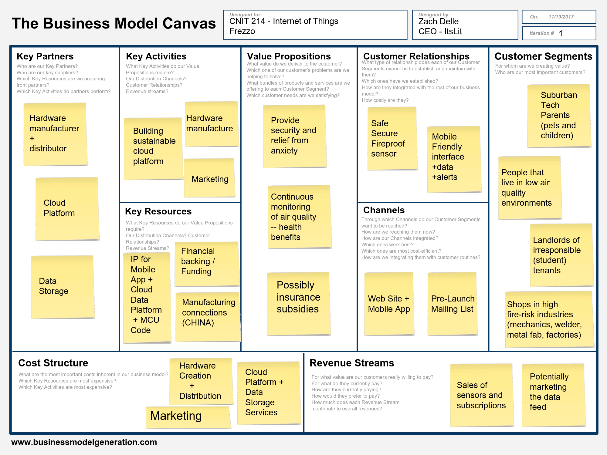
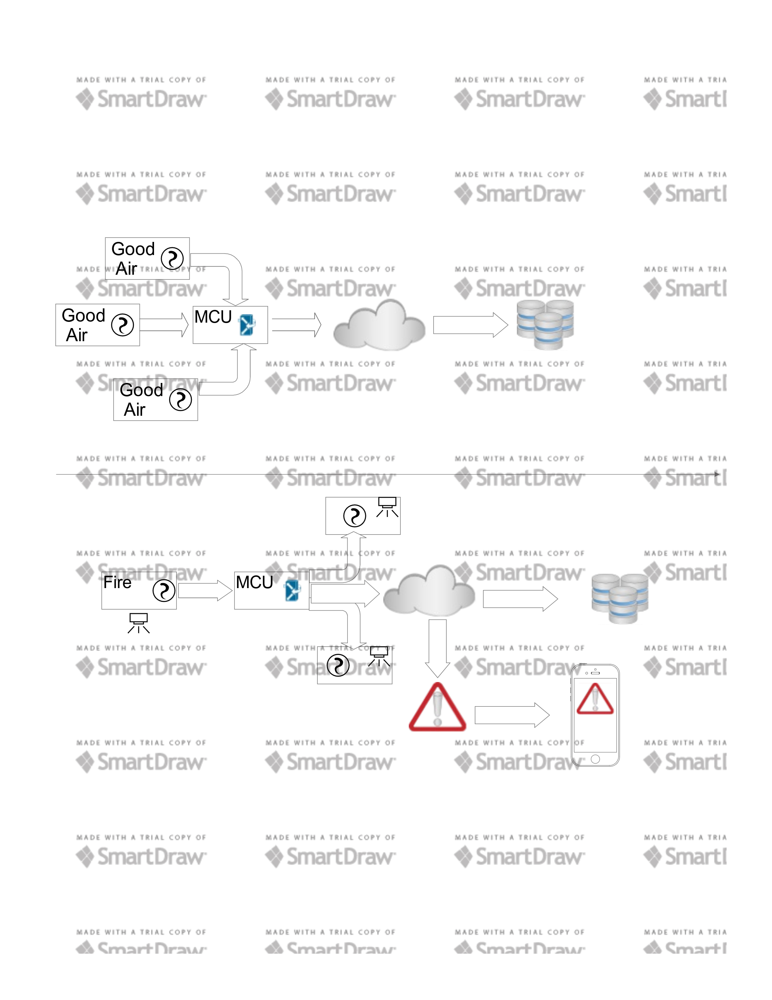
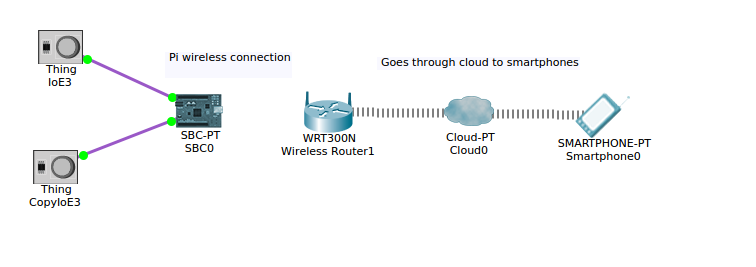
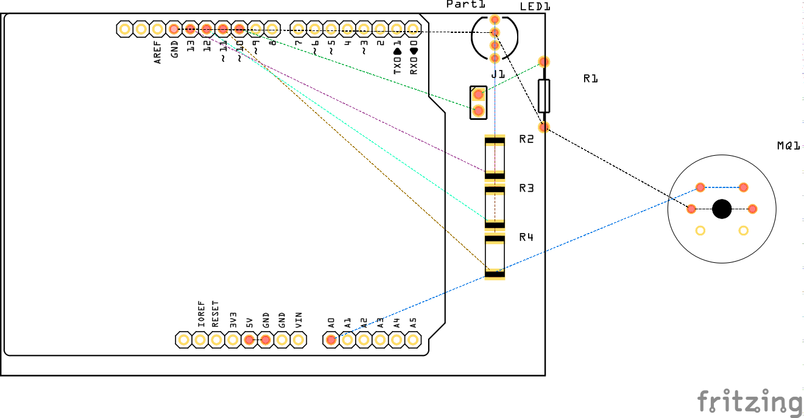
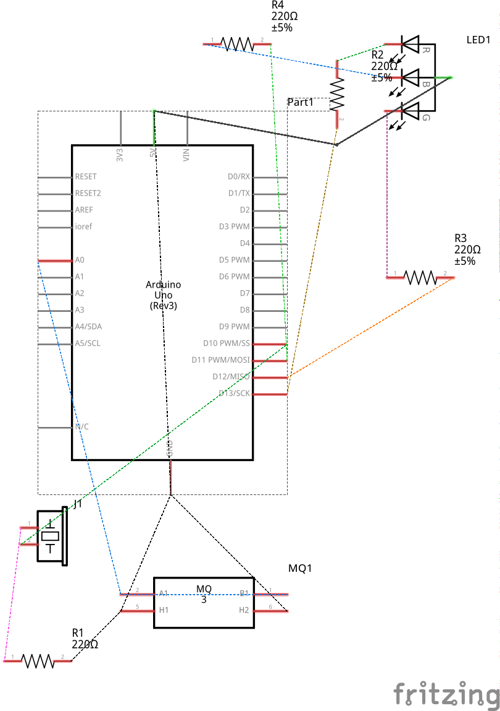
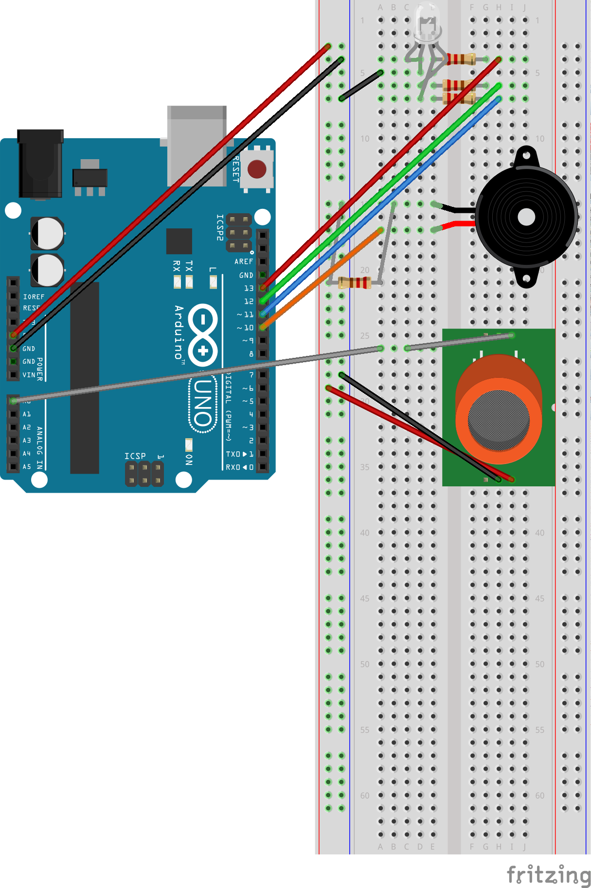

# Documentation

Below is a list of essential documents and diagrams for any IoT product. In the case of ItsLit, we have a largely open-loop system with a singular data load (from the sensor to the SBC to the application) but no feedback mechanisms. Perhaps in the future a recalibrate functionality could provide return feedback from the App to the SBC/sensors, but as of now the system is maintained a simple one-way data relay.

## Process Diagrams

### Storyboard

### Sequence Diagram

## Business Model Canvas 

## Network Diagrams

### Block Diagram

### Logical Network Topology

# Circuit Diagrams

### PCB

### Schematic

### Arduino Example

